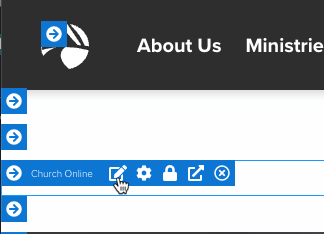
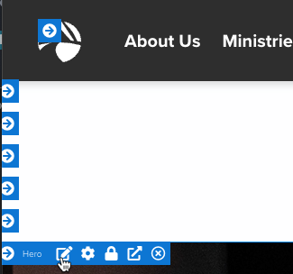

# Update Summit Online Service Times

**The following pages need to be updated:**

1. [Summit Home Page](https://summitchurch.com/)
2. [Summit Online Page](https://summitchurch.com/online)

## Summit Home Page

You will only make this change the week before the special service/event, otherwise it will break it for the current weekend services. Once you make this update, **please make sure to set yourself a reminder/task to revert these changes after the special service/event.**

<figure><figcaption></figcaption></figure>

1. Navigate to the Summit home page and edit the block that is labeled **Church Online** which is at the top of the page.&#x20;
2. Once you open this block, you will see the following code. You will look at the very first line where it shows: \
   &#xNAN;**{\[ scheduledcontent scheduleid:'16799,16800,16801' showwhen:'live' ]}**
3. Next, you will go to the [Schedules page](https://staff.summitchurch.com/admin/checkin/schedules) in Rock, and locate the schedules for the special services/events you will need to update this code. Example: For Church at the Dome, you would navigated to **Event Schedules > Church at the Dome > 10 a.m. or 3 p.m.**
4. Click on the schedule, and in the URL you will see: staff.summitchurch.com/admin/checkin/schedules?ScheduleId=**21161.**&#x20;
5. Copy the value in bold.
6. Navigate back to the code in Step #2 above and replace the ids that are listed with the new Ids you copied.
7. Your code should now look like:\
   &#xNAN;**{\[ scheduledcontent scheduleid:'21161,21161' showwhen:'live' ]}**
8. Click **Save.**

## Summit Online Page

You will only make this change the week before the special service/event, otherwise it will break it for the current weekend services. Once you make this update, **please make sure to set yourself a reminder/task to revert these changes after the special service/event.**

<figure><figcaption></figcaption></figure>

1. Navigate to the [Summit Online page](https://summitchurch.com/online) and edit the block that is labeled **Hero** which is at the top of the page.
2. At the top of the code (line 9), you will see the following:\
   &#xNAN;**\{% assign serviceSchedules = '16799,16800,16801' %\}**
3. Using the same Schedule Ids from the above examples, you will update this line to look like:\
   &#xNAN;**\{% assign serviceSchedules = '21161,21162' %\}**
4. Click **Save.**

