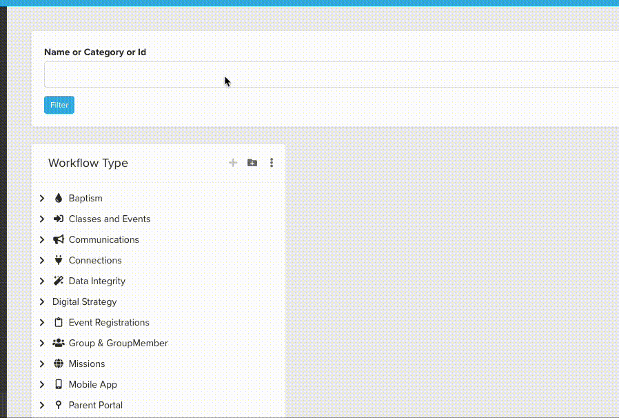

# WorkflowType Search

### Observation:

1. If I want to search for "Landing Page", the current search box navigates me to a separate page.
2. If I want to search for WorkflowTypeId, the current search box does not offer that functionality.
3. If I want to search for WorkflowType's Category name, I cannot do that either.

<figure><figcaption></figcaption></figure>

### Solution:

1. I created a new **Page Parameter Filter** Block [BlockId: 13833].
   - You can search by WorkflowType Name, Category, or Id
2. I deleted the old search Block [BlockId: 8375].
   - I also deleted the corresponding Page [PageId: 3652].

<figure><figcaption></figcaption></figure>
